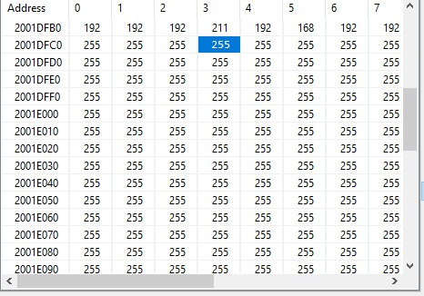
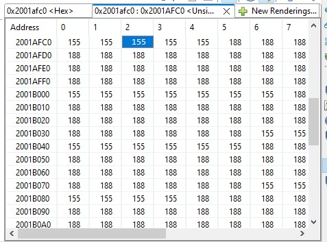

# EE4065 – Embedded Digital Image Processing

This repository contains the source files and project setup for **EE4065 – Embedded Digital Image Processing Homework 1**, implemented on **STM32F446** using **STM32CubeIDE**.

## Overview

The project demonstrates:
- Converting a grayscale image into a header file and displaying pixel values in MCU memory.  
- Applying several intensity transformations directly on the microcontroller.  
- Observing and verifying results through the **Memory Window** in STM32CubeIDE.

---

## Q1 – Grayscale Image Creation and Display

**Task summary:**
1. Create a grayscale image of suitable size on your PC (e.g., 64×64 pixels, 8-bit grayscale).  
2. Convert the image to a C header file (array of pixel values).  
3. Add this header file to your STM32 project.  
4. Display selected image entries by observing memory locations in STM32CubeIDE.

**Files involved:**
- `image.h` – contains the grayscale image data and dimension definitions.  
- `main.c` – includes code to read and display sample pixel values from memory.  

**Observation:**  
Use the **Memory Window** under STM32CubeIDE to check the image data stored in memory.

---

## Q2 – Intensity Transformations

Apply the following transformations to the same image and verify the results using the memory viewer.

### a) Negative Image
Compute the negative of each pixel value:

    s = 255 - r

### b) Thresholding
Set pixel values above a certain threshold \( T \) to 255 and others to 0.

    FUNCTION threshold(image, T = 116):
        FOR each pixel p IN image:
            p ← 255 IF p > T ELSE 0
    END FUNCTION

### c) Gamma Correction
Apply gamma correction for:
- \( gamma = 3 \)
- \( gamma = 1/3 \)

	    s = 255 * (r/255)^gamma

### d) Piecewise Linear Transformation
Use a piecewise linear function based on the same threshold \( T \) from part (b).  
Define two linear sections with different slopes to stretch or compress contrast in specific ranges.

    FOR each pixel p IN image:
        IF p ≤ T THEN
            p ← (p / T) * 128
        ELSE
            p ← 128 + ((p - T) / (255 - T)) * 127
        END IF
    END FOR

---

## Verification

Use **STM32CubeIDE → Debug → Memory Window** to:
- View the original image array and the transformed versions.
- Compare memory values for different transformation outputs.

---

## Project Structure

Core/  
├── Inc/  
│ ├── image.h  
├── Src/  
│ ├── main.c  

---

## Notes

- Use 8-bit unsigned integers (`uint8_t`) for pixel data.  
- Choose a small image to fit into MCU RAM (e.g., 64×64).  
- The math library (`math.h`) may be required for gamma correction.  

---

## Results
 

| *Transformed Images* | *Memory Entries*  |
|--|--|
|   |   |
|  |  |
|  |  |
|  |  |
|  |  |

---

**Author:**  
Muhammed Ali Yesin  
Mehmet Karayazgan
