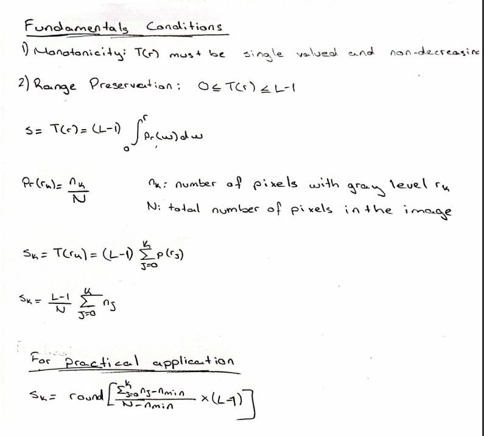
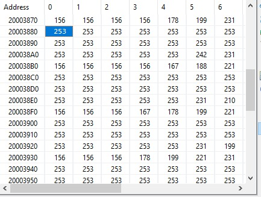
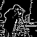
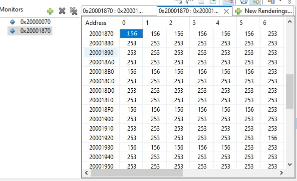

# EE4065 – Embedded Digital Image Processing

This repository contains the source files and project setup for **EE4065 – Embedded Digital Image Processing Homework 2**, implemented on **STM32F446** using **STM32CubeIDE**.

## Overview

The project demonstrates:
- Forming the **histogram** of a grayscale image on the microcontroller.  
- Applying **histogram equalization** to enhance image contrast.  
- Implementing **2D convolution-based low-pass and high-pass filtering**.  
- Implementing **median filtering** for noise reduction.  
- Observing and verifying results through the **Memory Window** in STM32CubeIDE.

---

## Q1 – Histogram Formation

**Task summary:**
1. Create a grayscale image of suitable size on your PC (e.g., 64×64 pixels, 8-bit grayscale).  
2. Convert the image to a C header file (array of pixel values).  
3. Add this header file to your STM32 project.  
4. Implement a C function on the microcontroller to compute the histogram (0–255) of the given image.  
5. Display selected histogram entries by observing memory locations in STM32CubeIDE.

**Files involved:**
- `image.h` – contains the grayscale image data and dimension definitions.  
- `main.c` – includes the main application flow and function calls.  
- `histogram.c / histogram.h` (if used) – contain the histogram computation functions.  

**Observation:**  
Use the **Memory Window** under STM32CubeIDE to inspect some of the histogram bins (e.g., `H[0]`, `H[50]`, `H[120]`, etc.) stored in memory.

---

## Q2 – Histogram Equalization

Apply histogram equalization to the same grayscale image and verify the results using the memory viewer.

### a) Theoretical Derivation

Derive the histogram equalization method on paper and include a photo of the derivation in the homework report, as requested in the assignment.

The standard mapping from input level \( r_k \) to output level \( s_k \) is based on the cumulative distribution function (CDF):

### b) C Function for Histogram Equalization

Form a C function on the microcontroller to apply histogram equalization to a given grayscale image:

1. Compute the histogram of the input image.  
2. Compute the normalized CDF.  
3. Map each input intensity value to an output value using the equalization formula.  
4. Store the result in a separate output image buffer.

### c) Application and Display

Use the grayscale image formed in Q1. Apply histogram equalization and:

- Show some of the equalized image entries via the **Memory Window** in STM32CubeIDE.  
- Optionally compute and inspect the histogram of the equalized image.

The resulting equalized image is stored as:

- `outputs/eq.bmp` – Histogram equalized image.  

---

## Q3 – 2D Convolution and Filtering

### 2D Convolution Function

The project implements 2D convolution using a custom function that processes the image pixel-by-pixel together with a given filter kernel. For each pixel, the function slides the kernel over the image, multiplies corresponding values, and accumulates the result.

The kernel is centered on the current pixel, and for border regions the code uses **clamping**, meaning out-of-bounds indices are replaced with the nearest valid pixel. This prevents memory access errors and keeps the filter behavior stable on the edges.

Each kernel value is multiplied with the corresponding input pixel, summed into a floating-point accumulator, and then rounded and clamped to the 0–255 range before writing to the output buffer. Because the function accepts any kernel and kernel size, it can perform low-pass (smoothing), high-pass (edge enhancement), or any linear convolution-based filtering used in the assignment.

This function forms the core of Homework 2 – Q3, enabling the low-pass and high-pass filtered images by applying the respective 3×3 kernels to the equalized image.

### a) 2D Convolution Function

Form a C function on the microcontroller to apply 2D convolution on a given grayscale image:

- Use a sliding window over the image.  
- Multiply neighborhood pixels by the filter kernel coefficients.  
- Sum the products and assign the result to the corresponding output pixel.  
- Handle borders appropriately (e.g., zero-padding or ignoring borders).

### b) Low-pass Filtering

Use the grayscale image formed in Q1. Apply **low-pass filtering** (smoothing) using an appropriate kernel (e.g., averaging filter)

Display some of the filtered image entries via the **Memory Window** in STM32CubeIDE.

Outputs:
- `outputs/lp.bmp` – Low-pass filtered image.  
- `outputs/lp_mem.bmp` – Screenshot or visualization of low-pass filtered image entries in memory.

### c) High-pass Filtering

Using the same grayscale image, apply **high-pass filtering** (edge enhancement) using an appropriate kernel (e.g., Laplacian-like filter)

Again, show some of the filtered image entries in the **Memory Window**.

Outputs:
- `outputs/hp.bmp` – High-pass filtered image.  
- `outputs/hp_mem.bmp` – Screenshot or visualization of high-pass filtered image entries in memory.

---

## Q4 – Median Filtering

### a) Median Filter Function

Form a C function on the microcontroller to apply **median filtering** on a given grayscale image:

1. Define a neighborhood window (e.g., 3×3).  
2. Collect the pixel values within the window into an array.  
3. Sort the values and select the median.  
4. Assign the median value to the output pixel.  

This method is especially useful for removing impulse (salt-and-pepper) noise.

### b) Application and Display

Use the same grayscale image as in Q1. Apply the median filter and:

- Show some of the filtered image entries in **STM32CubeIDE → Memory Window**.

Outputs:
- `outputs/med.bmp` – Median filtered image.  
- `outputs/med_mem.bmp` – Screenshot or visualization of median filtered image entries in memory.

---

## Verification

Use **STM32CubeIDE → Debug → Memory Window** to:

- View the original image array and all processed versions (equalized, low-pass, high-pass, median filtered).  
- Inspect selected histogram bins and filtered image entries.  
- Compare input and output values for each processing step.

---

## Project Structure

Core/  
├── Inc/  
│ ├── image_to_process.h   
├── Src/  
│ ├── main.c  
outputs/  
├── orj.bmp        *(Original image)*  
├── eq.bmp         *(Histogram equalized image)*  
├── lp.bmp         *(Low-pass filtered image)*  
├── lp_mem.jpg     *(Low-pass filter memory view)*  
├── hp.bmp         *(High-pass filtered image)*  
├── hp_mem.jpg     *(High-pass filter memory view)*  
├── med.bmp        *(Median filtered image)*  
├── med_mem.jpg    *(Median filter memory view)*  

---

## Notes

- Use 8-bit unsigned integers (`uint8_t`) for pixel data.  
- Choose a small image size (e.g., 64×64) to fit into MCU RAM.    

---

## Results

 

| | *Processed Images* | *Memory Entries* |
|--|--|--|
|Histogram Equalized Image|  | - |
|Low-pass Filtered Image|  |  |
|High-pass Filtered Image|  |  |
|Median Filtered Image|  |  |

---

**Author:**  
Muhammed Ali Yesin 150720066  
Mehmet Karayazgan 150720070
