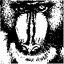

# 🧠 EE4065: Embedded Digital Image Processing - Homework 3

This project implements the theoretical foundations of automated image segmentation and structural analysis directly on an embedded platform. The focus is on the algorithmic efficiency and mathematical accuracy of **Otsu's Global Thresholding** and **Morphological Image Processing**.

---

## 🔬 Theoretical Framework: Otsu's Thresholding (Q1 & Q2)

Otsu's method is a non-parametric and unsupervised method for automatic threshold selection. Unlike simple thresholding, which relies on a fixed value, Otsu's method treats the image as a bimodal distribution of intensities.

### The Objective
The goal is to find an optimal threshold value ($t$) that minimizes the **intra-class variance** (variance within the background and foreground) or, equivalently, maximizes the **inter-class variance** (variance between the two groups).

### Mathematical Derivation
We define the image histogram with $L$ intensity levels $[0, 1, \dots, L-1]$. For any chosen threshold $t$, the pixels are divided into two classes: $C_B$ (Background) and $C_F$ (Foreground).

1. **Class Probabilities ($\omega$):**
   $$\omega_B(t) = \sum_{i=0}^{t} p(i), \quad \omega_F(t) = \sum_{i=t+1}^{L-1} p(i)$$
   
2. **Class Means ($\mu$):**
   $$\mu_B(t) = \sum_{i=0}^{t} \frac{i \cdot p(i)}{\omega_B(t)}, \quad \mu_F(t) = \sum_{i=t+1}^{L-1} \frac{i \cdot p(i)}{\omega_F(t)}$$

3. **Maximizing Inter-class Variance ($\sigma_b^2$):**
   The algorithm iterates through all possible values of $t \in [0, 255]$ to find the one that maximizes:
   $$\sigma_b^2(t) = \omega_B(t) \omega_F(t) [\mu_B(t) - \mu_F(t)]^2$$

In this project, the STM32 performs this iteration in real-time, enabling the system to adapt to varying lighting conditions without manual recalibration.

---

## 🧬 Theoretical Framework: Morphological Operations (Q3)

Morphology is a broad set of image processing operations that process images based on shapes. These operations apply a **structuring element** (kernel) to an input image, creating an output image of the same size.

### The Structuring Element (SE)
In this implementation, we use a $3 \times 3$ square structuring element. The value of each pixel in the output image is based on a comparison of the corresponding pixel in the input image with its neighbors.

### 1. Dilation (The "OR" Operation)
Dilation adds pixels to the boundaries of objects in an image. In the binary sense, if at least one pixel under the structuring element is $1$ (foreground), the center pixel is set to $1$.
* **Application:** Closing small holes within objects or connecting broken strokes in handwritten digits (MNIST).

### 2. Erosion (The "AND" Operation)
Erosion removes pixels on object boundaries. A pixel is kept as $1$ only if **every** pixel under the structuring element is $1$. If any neighbor is $0$, the center pixel becomes $0$.
* **Application:** Removing "salt" noise (isolated white pixels) and thinning the structures of digits to extract their skeletons.

### Why MNIST for Morphology?
While complex scenes are great for Otsu, morphological operations are best demonstrated on structured data. MNIST digits provide clear topological features. By upscaling these $28 \times 28$ samples to $128 \times 128$ using **Nearest Neighbor Interpolation**, we preserve the sharp binary transitions necessary for the $3 \times 3$ kernel to produce meaningful thinning and thickening effects.

---

## 🖼 Comparative Analysis
The following results highlight the transition from raw intensity data to binary structural information.

| Dataset | Process | Output |
| :--- | :--- | :--- |
| **Real Scene** | Otsu Segmentation |  |
| **MNIST Digit** | Input Binary |  |
| **MNIST Digit** | Dilation (Expansion) |  |
| **MNIST Digit** | Erosion (Reduction) |  |

---

## 🛠 Project Execution
The software architecture follows a strict request-response pattern:
1. **Python Client:** Handles dataset management (MNIST loading) and image normalization.
2. **Embedded Server (MCU):** Receives the raw byte-stream and executes the selected mathematical model ($O(N)$ for Otsu, $O(N \times K^2)$ for Morphology).
3. **Synchronization:** Data integrity is maintained via a 115200 baud UART link with fixed-size packet framing.

**Developed by:** [Your Name]
**Academic Year:** 2025 - EE4065 Embedded Digital Image Processing