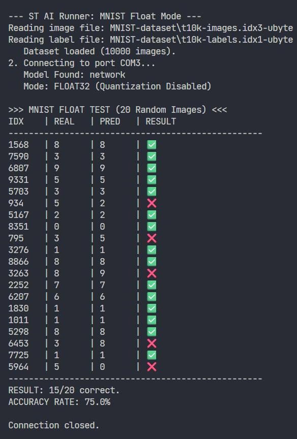
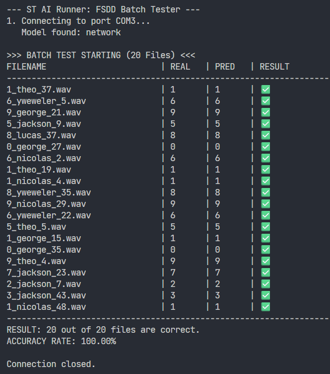

# STM32 Embedded Machine Learning: Keyword Spotting & Digit Recognition

This repository contains an end-to-end implementation of **Keyword Spotting (KWS)** and **Handwritten Digit Recognition (MNIST)** on the **STM32F446RE** development board.

The project implements **Section 12.8** and **Section 12.9** of the textbook *"Embedded Machine Learning with Microcontrollers: Applications on STM32 Development Boards"*. It demonstrates the complete pipeline: training Keras models, converting them to C using **ST Edge AI Developer Cloud**, and performing hardware-in-the-loop inference validation via Python.

---

## 📂 Project Structure

| Folder/File | Description |
| :--- | :--- |
| `fsdd/` | STM32CubeIDE Firmware project for Audio Classification. |
| `mnist/` | STM32CubeIDE Firmware project for Digit Recognition. |
| `Listing11_5_updated.py` | Training script for FSDD (Audio) using MFCC features. |
| `Listing11_6.py` | Training script for MNIST (Image) using Hu Moments. |
| `fsdd_serial.py` | Serial client to test audio inference on the board. |
| `mnist_serial.py` | Serial client to test image inference on the board. |
| `mfcc_func.py` | Helper functions for MFCC feature extraction. |

---

## 🤖 Pre-trained Models (Skip Training)

You do **not** need to run the training scripts (`Listing11_5_updated.py` or `Listing11_6.py`) to use this project. We have provided the pre-trained Keras model files ready for deployment.

* **Audio Model:** `mlp_fsdd_model.h5` (Used for FSDD / Keyword Spotting)
* **Image Model:** `mnist_my_training.h5` (Used for MNIST / Digit Recognition)

> **💡 Quick Tip:** Copies of these `.h5` files are also located inside their respective STM32CubeIDE project folders (`fsdd/` and `mnist/`). You can use them directly to generate C code via STM32Cube.AI if needed.

---

## 🧠 Model Architectures & Feature Extraction

### 1. Keyword Spotting (FSDD)
* **Dataset:** Free Spoken Digit Dataset (0-9).
* **Feature Extraction:** 26 **MFCC** (Mel-frequency cepstral coefficients) features. The raw audio (8kHz) is processed using **CMSIS-DSP** logic in Python to match the board's DSP capability.
* **Model:** MLP (Dense Layers: 100 -> 100 -> 10).
* **Input Shape:** `(1, 26)` Float32.

### 2. Digit Recognition (MNIST)
* **Dataset:** MNIST (Handwritten digits 0-9).
* **Feature Extraction:** 7 **Hu Moments**. Instead of feeding raw pixels ($28 \times 28$), we calculate shape-invariant moments using OpenCV (`cv2.HuMoments`). This makes the model rotation and scale-invariant.
* **Model:** MLP (Dense Layers: 100 -> 100 -> 10).
* **Input Shape:** `(1, 7)` Float32.

> **Note on Quantization:** Both models use **Float32** inputs to maintain precision for the calculated features. The quantization parameters (scale/zero-point) were disabled to ensure accurate feature mapping.

---

## 🛠 Hardware & Software Setup

### 1. Hardware
* **Board:** NUCLEO-F446RE (STM32F446RE).
* **Connection:** USB Mini-B (Virtual COM Port).

### 2. Firmware Installation
1.  Open **STM32CubeIDE**.
2.  Import the projects located in the `fsdd` or `mnist` folders.
3.  Build and **Run/Debug** to flash the code onto the board.
4.  The board will start waiting for data over UART.

### 3. Python Environment

You need to install the required libraries to run the PC-side scripts.

> [!WARNING]
> **Critical Protobuf Version Issue**
> The `stm_ai_runner` utility (used to communicate with the board) requires an older version of Protobuf. Newer versions (4.x+) installed by standard TensorFlow will cause connection errors.
>
> Please install this specific version:
> ```bash
> pip install protobuf==3.20.3
> ```

**Install Dependencies:**
```bash
pip install numpy scipy opencv-python cmsisdsp pyserial tensorflow
```
*Note: The `stm_ai_runner` module is based on the [ST ModelZoo Services](https://github.com/STMicroelectronics/stm32ai-modelzoo-services/tree/main/common/stm_ai_runner).*

---

## 🚀 How to Run

### Step 1: Flash the Board

Flash either the FSDD or MNIST firmware depending on which test you want to run.

### Step 2: Run the Serial Script

The Python scripts pick random samples from the dataset, process them (MFCC or Hu Moments), send them to the STM32 via USB, and print the prediction received from the board.

**For Audio (FSDD):**

```bash
python fsdd_serial.py

```

**For Images (MNIST):**

```bash
python mnist_serial.py

```

---

## 📊 Results

The following screenshots demonstrate the real-time inference results obtained from the STM32F446RE via the serial interface.

### MNIST Inference Result
* **Method:** Hu Moments (7 Features)
* **Accuracy:** ~75% (Hardware-in-the-loop)



### FSDD Inference Result
* **Method:** MFCC (26 Features)
* **Accuracy:** 100% (Hardware-in-the-loop on random batch)



---

## 🔗 References

* **Book Repo:** [Embedded Machine Learning with Microcontrollers](https://github.com/EmbeddedML/Embedded-Machine-Learning-with-Microcontrollers-Applications-on-STM32-Development-Boards)
* **ST Edge AI:** [STM32Cube.AI Developer Cloud](https://stm32ai-cs.st.com/home)
* **AI Runner:** [ST ModelZoo Services](https://github.com/STMicroelectronics/stm32ai-modelzoo-services)

---

## 👥 Authors

* **Muhammed Ali Yesin** - [GitHub Profile](https://github.com/yesinali)
* **Mehmet Karayazgan** - [GitHub Profile](https://github.com/kryzgn)
