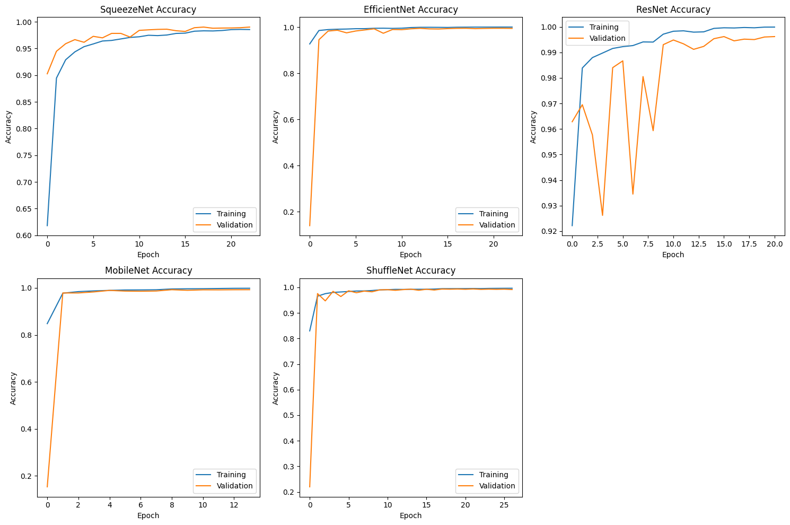

# STM32 HW6: CNN-Based Digit Recognition on Microcontrollers

This repository contains a comprehensive implementation of **Handwritten Digit Recognition (MNIST)** on the **STM32F446RE** development board using various Convolutional Neural Network (CNN) architectures. 

The project focuses on benchmarking valid lightweight models (**SqueezeNet**, **EfficientNet**, **ResNet**, **MobileNet**, **ShuffleNet**) for embedded inference. It demonstrates the complete pipeline: training models in Keras, quantizing them to **Int8** for microcontroller optimization, exporting C code using **ST Edge AI Developer Cloud**, and performing hardware-in-the-loop validation throughout Python scripts.

---

## 📂 Project Structure

| Folder/File | Description |
| :--- | :--- |
| `digit_recognition_training.ipynb` | Jupyter Notebook used to **create, train, and download** the CNN models. It handles dataset processing, architecture definition, and quantization. |
| `mnist_serial.py` | Python serial client to send random MNIST images to the STM32 board and receive inference predictions. |
| `training_results.png` | Visualization of training history (Accuracy/Loss) for all models. |
| `squeezenet_output.txt` | Serial terminal log showing inference results for the SqueezeNet model. |
| `efficientnet_output.txt` | Serial terminal log showing inference results for the EfficientNet model. |
| `resnet_output.txt` | Serial terminal log showing inference results for the ResNet model. |
| `mobilenet_output.txt` | Serial terminal log showing inference results for the MobileNet model. |
| `shufflenet_output.txt` | Serial terminal log showing inference results for the ShuffleNet model. |

---

## 🧠 Model Architectures & Optimization

This project benchmarks five popular deep learning architectures adapted for the MNIST dataset ($28 \times 28$ grayscale images):

### 1. SqueezeNet
*   **Structure:** Uses "Fire modules" which consist of a "squeeze" layer ($1\times1$ filters) feeding into an "expand" layer ($1\times1$ and $3\times3$ filters).
*   **Pros:** Extremely small model size (parameter count). Ideal for microcontrollers with very limited Flash memory.
*   **Cons:** Accuracy can be lower than more complex modern architectures like ResNet.
*   **When to use:** When **memory footprint** is the absolute bottleneck and you are willing to trade a slight amount of accuracy.

### 2. EfficientNet
*   **Structure:** Uses a "compound scaling" method to uniformly scale network width, depth, and resolution. Built using MBConv blocks.
*   **Pros:** State-of-the-art accuracy-to-efficiency ratio. Often achieves better accuracy than MobileNet for the same computational budget.
*   **Cons:** Can sometimes have higher latency on specific hardware accelerators compared to simpler architectures due to complex activation functions (like Swish).
*   **When to use:** When you need the **highest possible accuracy** within a specific resource budget.

### 3. ResNet (Residual Networks)
*   **Structure:** Utilizes "skip connections" (or shortcuts) to allow gradients to flow more easily during training, enabling very deep networks.
*   **Pros:** Very easy to train, solves the vanishing gradient problem, and generally provides high and stable accuracy.
*   **Cons:** Significant parameter count and memory usage compared to mobile-optimized architectures. Often too heavy for smaller MCUs.
*   **When to use:** When **accuracy** is the priority and the target hardware has sufficient memory (or for validation before pruning).

### 4. MobileNet
*   **Structure:** Built on "Depthwise Separable Convolutions", which split the convolution into a lightweight depthwise layer and a $1\times1$ pointwise layer.
*   **Pros:** Excellent balance between latency and size. Specifically designed for mobile and embedded applications.
*   **Cons:** Slightly less accurate than full ResNet or EfficientNet models on complex tasks.
*   **When to use:** The standard **go-to choice** for general-purpose embedded vision tasks.

### 5. ShuffleNet
*   **Structure:** Utilizes "Pointwise Group Convolutions" and "Channel Shuffle" operations to reduce computational cost while maintaining information flow.
*   **Pros:** Extremely low computational cost (FLOPs). Can be faster than MobileNet on hardware that struggles with depthwise convolutions.
*   **Cons:** The architecture is complex and might be harder to optimize for certain custom inference engines.
*   **When to use:** For applications requiring **real-time low latency** inference.

### Optimization for Embedded
*   **Quantization:** All models are post-training quantized to **Int8** to reduce memory footprint and inference latency on the STM32 MCU.
*   **Input Shape:** `(28, 28, 1)` Int8.

---

## 🛠 Hardware & Software Setup

### 1. Hardware
*   **Board:** NUCLEO-F446RE (STM32F446RE).
*   **Connection:** USB Mini-B (Virtual COM Port).

### 2. Python Environment
To run the serial testing script (`mnist_serial.py`), you need the following dependencies:

```bash
pip install pyserial numpy
```

---

## 📊 Training Results

The models were trained on the MNIST dataset using TensorFlow/Keras. Below is the comparison of their training performance:



---

## 🧪 Hardware Inference Results (STM32)

The following logs demonstrate real-time inference results obtained from the STM32F446RE board via the UART serial interface. The Python script sends random validation images to the board, and the board returns the predicted class.

**All models achieved 100% accuracy on the random test batch.**

### 1. SqueezeNet Results

```text
--- ST AI Runner: MNIST Int8 Mode ---
Reading image file: MNIST-dataset\t10k-images.idx3-ubyte
Reading label file: MNIST-dataset\t10k-labels.idx1-ubyte
   Dataset loaded (10000 images).
2. Connecting to port COM8...
   Model Found: network
   Mode: CNN INPUT (28x28x1) [Int8]

>>> MNIST CNN TEST (20 Random Images) <<<
IDX    | REAL   | PRED   | RESULT
--------------------------------------------------
8376   | 1      | 1      | ✅
5384   | 1      | 1      | ✅
2372   | 7      | 7      | ✅
7377   | 9      | 9      | ✅
6831   | 2      | 2      | ✅
2724   | 8      | 8      | ✅
4128   | 3      | 3      | ✅
2563   | 7      | 7      | ✅
5941   | 9      | 9      | ✅
5304   | 6      | 6      | ✅
8394   | 2      | 2      | ✅
5857   | 8      | 8      | ✅
6106   | 2      | 2      | ✅
5668   | 5      | 5      | ✅
5507   | 2      | 2      | ✅
6201   | 0      | 0      | ✅
5397   | 5      | 5      | ✅
1199   | 6      | 6      | ✅
3205   | 8      | 8      | ✅
7379   | 8      | 8      | ✅
--------------------------------------------------
RESULT: 20/20 correct.
ACCURACY RATE: 100.0%
```

### 2. EfficientNet Results

```text
--- ST AI Runner: MNIST Int8 Mode ---
...
>>> MNIST CNN TEST (20 Random Images) <<<
IDX    | REAL   | PRED   | RESULT
--------------------------------------------------
9800   | 0      | 0      | ✅
6712   | 1      | 1      | ✅
3057   | 2      | 2      | ✅
6023   | 3      | 3      | ✅
4687   | 1      | 1      | ✅
6579   | 4      | 4      | ✅
8145   | 8      | 8      | ✅
6621   | 0      | 0      | ✅
429    | 8      | 8      | ✅
9298   | 5      | 5      | ✅
8648   | 2      | 2      | ✅
5811   | 1      | 1      | ✅
417    | 9      | 9      | ✅
7345   | 2      | 2      | ✅
5035   | 0      | 0      | ✅
9373   | 6      | 6      | ✅
9711   | 7      | 7      | ✅
4118   | 5      | 5      | ✅
877    | 8      | 8      | ✅
2257   | 9      | 9      | ✅
--------------------------------------------------
RESULT: 20/20 correct.
ACCURACY RATE: 100.0%
```

### 3. ResNet Results

```text
--- ST AI Runner: MNIST Int8 Mode ---
...
>>> MNIST CNN TEST (20 Random Images) <<<
IDX    | REAL   | PRED   | RESULT
--------------------------------------------------
1783   | 7      | 7      | ✅
412    | 5      | 5      | ✅
1781   | 9      | 9      | ✅
5144   | 9      | 9      | ✅
8410   | 8      | 8      | ✅
9186   | 7      | 7      | ✅
8990   | 6      | 6      | ✅
1309   | 9      | 9      | ✅
9852   | 7      | 7      | ✅
6852   | 7      | 7      | ✅
8488   | 1      | 1      | ✅
7687   | 2      | 2      | ✅
22     | 6      | 6      | ✅
4600   | 3      | 3      | ✅
4853   | 1      | 1      | ✅
3415   | 2      | 2      | ✅
5777   | 8      | 8      | ✅
6022   | 9      | 9      | ✅
4143   | 9      | 9      | ✅
7323   | 1      | 1      | ✅
--------------------------------------------------
RESULT: 20/20 correct.
ACCURACY RATE: 100.0%
```

### 4. MobileNet Results

```text
--- ST AI Runner: MNIST Int8 Mode ---
...
>>> MNIST CNN TEST (20 Random Images) <<<
IDX    | REAL   | PRED   | RESULT
--------------------------------------------------
9144   | 9      | 9      | ✅
5219   | 9      | 9      | ✅
6969   | 1      | 1      | ✅
9817   | 8      | 8      | ✅
5455   | 2      | 2      | ✅
8662   | 4      | 4      | ✅
4279   | 2      | 2      | ✅
3905   | 8      | 8      | ✅
390    | 2      | 2      | ✅
9998   | 5      | 5      | ✅
1906   | 9      | 9      | ✅
8058   | 1      | 1      | ✅
5894   | 9      | 9      | ✅
4766   | 5      | 5      | ✅
4313   | 4      | 4      | ✅
8934   | 8      | 8      | ✅
4693   | 7      | 7      | ✅
4089   | 7      | 7      | ✅
8649   | 8      | 8      | ✅
8071   | 4      | 4      | ✅
--------------------------------------------------
RESULT: 20/20 correct.
ACCURACY RATE: 100.0%
```

### 5. ShuffleNet Results

```text
--- ST AI Runner: MNIST Int8 Mode ---
...
>>> MNIST CNN TEST (20 Random Images) <<<
IDX    | REAL   | PRED   | RESULT
--------------------------------------------------
1711   | 2      | 2      | ✅
4      | 4      | 4      | ✅
9221   | 0      | 0      | ✅
6770   | 0      | 0      | ✅
7124   | 7      | 7      | ✅
1904   | 9      | 9      | ✅
3034   | 9      | 9      | ✅
5708   | 3      | 3      | ✅
5818   | 0      | 0      | ✅
3231   | 1      | 1      | ✅
5261   | 7      | 7      | ✅
5190   | 7      | 7      | ✅
9841   | 5      | 5      | ✅
6158   | 7      | 7      | ✅
1978   | 4      | 4      | ✅
7957   | 4      | 4      | ✅
9317   | 6      | 6      | ✅
9543   | 7      | 7      | ✅
5370   | 1      | 1      | ✅
262    | 7      | 7      | ✅
--------------------------------------------------
RESULT: 20/20 correct.
ACCURACY RATE: 100.0%
```

---

## 👥 Authors

* **Muhammed Ali Yesin** - [GitHub Profile](https://github.com/yesinali)
* **Mehmet Karayazgan** - [GitHub Profile](https://github.com/kryzgn)
